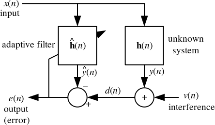

# gr-adaptive

GNU Radio module with several blocks for doing co-channel interference cancellation.

This module exposes four blocks:

* **_LMS Filter_** Uses a least means squares algorithm
* **_Normalized LMS Filter_** Uses the same least means squares algorithm as above but automatically adjusts the step size using the power of the input signals
* **_(Least squres filter not implemented yet)_**
* **_(Recursive Least Squares not implemented yet)_**

All four blocks wrap an FIR filter with filter taps which are adaptively
adjusted based on the input signals. The two inputs of each block are "SNOI"
(Signal Not Of Interest) and SOI-SNOI (The sum of SNOI and the Signal Of
Interest). In the following diagram, the SNOI corresponds to x[n] and the SOI
corresponds to v[n]. Note that the below image (and corresponding wikipedia
page) lists v[n] as "interference". This is opposite of how we are using the
adaptive filter in this GNU Radio module. Here, we apply the estimated filter
h[n] to the SNOI and add it to the SNOI + SOI, to cancel out the SNOI.

The filters included in this module are capable of subtracting out the SNOI
from SOI-SNOI even if the interfering signal has a different phase, amplitude,
or group delay. In fact, the group delay need not even be an integral sample
delay--each algorithm will automaticaclly construct a subsample linear-phase
delay filter if necessary to correct out sub-sample group delays.

Note that the block cannot correct for group delays longer than (num_taps) /
(sample_rate)

For the LMS block, the gradient descent parameter (mu) must be chosen
carefully. If mu is too small, the filter will take a long time to converge on
a solution, and will not be able to keep up with a changing channel. If mu is
too large, the solution may never converge. Additionally, runaway is possible.
If mu is too large, the FIR filter taps may grow unbounded.  This will
eventually cause floating point overflow, which will likely cause your gnuradio
flowgraph to seem to halt. Consider using the Normalized LMS Filter if this is
a strong concern.
 
